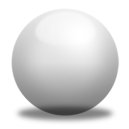

# Sandbox experiments

## Regular markdown

It's very easy to make some words **bold** and other words *italic* with Markdown. You can even [link to Google!](http://google.com)


1. One
2. Two
3. Three

Sometimes you want bullet points:

* Start a line with a star
* Profit!

Alternatively,

- Dashes work just as well
- And if you have sub points, put two spaces before the dash or star:
  - Like this
  - And this


> Coffee. The finest organic suspension ever devised... I beat the Borg with it.
> - Captain Janeway

*This text will be italic*
_This will also be italic_

**This text will be bold**
__This will also be bold__

_You **can** combine them_


If you want to embed images, this is how you do it:




## Code snippets

```
No syntax highlighting if no language
is indicated.
```


```python
note = "Python syntax highlighting"
print(node)
```


```{code-block} python
---
lineno-start: 10
emphasize-lines: 1, 3
---
a = 2
b = a + 4
c = a + b+ a + 4
print('my 1st line')
print(f'my {a}nd line')
```

## Tables

| a    | b    |
| :--- | ---: |
| c    | d    |


## Graphviz


The nodes below are clickable:

```{graphviz}
    digraph { 
        graph [fontname="Verdana", fontsize="16", bgcolor=transparent];

        regexp [URL="https://godoc.org/regexp" target="_blank"];
        bytes [URL="https://godoc.org/bytes"];
        io [URL="https://godoc.org/io"];

        regexp -> bytes;
        regexp -> io;
    }
```


## Notes


````{note}
The next info should be nested
```{warning}
Here's my warning
```
````

```{caution} Neque porro quisquam

   Lorem ipsum dolor sit amet, consectetur adipiscing elit. Vivamus mattis commodo eros, quis posuere enim lobortis quis. Nullam ut tempus nibh.
```

<br />


## Tabs


`````{tabs}
````{tab} App

        Apples are green, or sometimes red.

````
````{tab} Blue

        Blue something.

````
````{tab} Python

```{code-block} python
---
lineno-start: 10
emphasize-lines: 1, 3
---
a = 2
print('my 1st line')
print(f'my {a}nd line')
```        
````

`````


## Wavedrom

```{wavedrom}

        { "signal": [
                { "name": "clk",  "wave": "P......" },
                { "name": "bus",  "wave": "x.==.=x", "data": ["tiny", "body", "tail", "data"] },
                { "name": "wire", "wave": "0.1..0." }
        ]}
```


```{wavedrom}

        {"reg": [
                {"bits": 2,  "name": "BEGINING", "attr": ["0x7F"], "type": 5},
                {"bits": 4,  "name": "CRC", "attr": ["CRC16", "x1041","Bits 13:6"], "type": 2},
                {"bits": 2,  "name": "Ctrl", "attr": ["ON = x01", "OFF = x00"], "type": 4},
                {"bits": 2,  "name": "Size", "attr": "x01", "type": 4},
                {"bits": 2,  "name": "Cmd", "attr": "xAA", "type": 4},
                {"bits": 2,  "name": "Req/Reply", "attr": ["Req x01", "Rep x00"], "type": 4},
                {"bits": 12,  "name": "Head", "attr": ["xEB x90"], "type": 5}
        ], 
        "config":{"bits": 26}
        }
```
